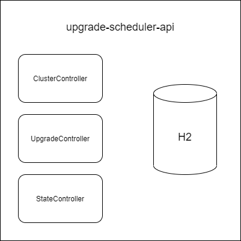

# Upgrade-Scheduler API
This is a draft for orchestrating new version releases in Pinot clusters with canary management.

Quick architecture overview of the api



## Features

- [x] Cluster controller
- [x] Upgrade controller
- [x] State controller
- [x] Canary release management
- [x] By % rollout
- [ ] By region rollout
- [ ] Random rollout

## Canary release


For the canary release, only the rollout by percentage has been implemented. This implementation takes two parameters, the percentage and a cluster id.

Here is the algorithm: 
````
(clusterId % 100) < percentage
````

## API rest documentation

The documentation is available [here](https://ragiroux.github.io/upgrade-scheduler-api/)
